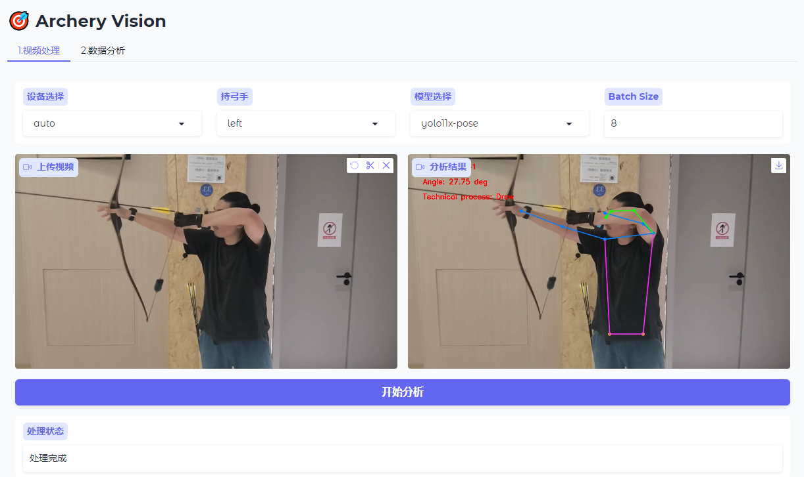
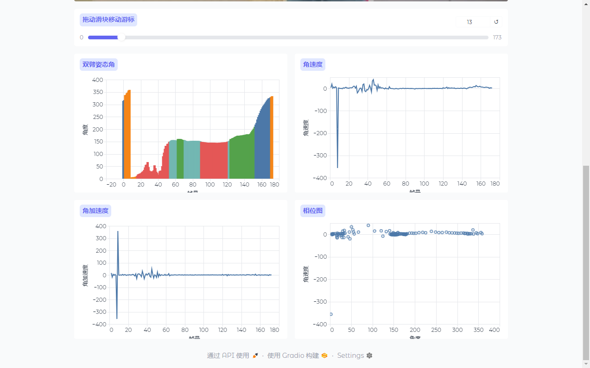

# 射箭姿态分析系统

基于计算机视觉的美式猎弓射手姿态分析系统，通过YOLO模型实时检测和分析射手的关键姿态点，帮助教练和运动员进行技术动作分析和改进。

## 功能特点

- 实时检测射手关键点位置
- 计算手臂夹角数据
- 自动识别射箭技术环节（举弓、开弓、固势、撒放）
- 视频处理并输出分析结果
- GPU加速支持

## 环境要求

- Python 3.13+
- CUDA支持（可选，用于GPU加速）

## 项目结构

```
archery_vision/
├── README.md                 # 项目说明文档
├── pyproject.toml           # 项目配置文件
├── uv.lock                 # uv包管理器依赖锁定文件
├── main.py                 # 命令处理入口
├── src/                    # 源代码目录
│   ├── core/              # 核心功能实现
│   │   ├── device.py     # 设备管理
│   │   ├── log.py       # 日志处理
│   │   ├── model.py     # 模型管理
│   │   ├── pose.py      # 姿态分析
│   │   └── video.py     # 视频处理
│   ├── enums/            # 枚举定义
│   │   └── action_state.py # 动作状态枚举
│   ├── models/           # 模型实现
│   └── webui/            # Web界面
│       ├── app.py       # 主界面应用
│       └── demo.py      # 演示程序
├── docs/                  # 文档目录
└── data/                  # 数据目录
    ├── models/           # 预训练模型
    ├── input/           # 输入视频
    └── output/          # 输出结果
```

## 安装说明

1. 克隆项目：
```bash
git clone https://github.com/yourusername/archery_vision.git
cd archery_vision
```

2. 使用uv创建虚拟环境：
```bash
uv venv
source .venv/bin/activate  # Linux/Mac
# 或
.venv\Scripts\activate     # Windows
```

3. 安装依赖：
```bash
uv sync
```

4. 模型下载：
系统会在首次运行时自动下载所需的YOLO模型。如果自动下载失败，请按以下步骤手动下载：

- 访问 [Ultralytics Model Hub](https://github.com/ultralytics/assets/releases/download/v8.3.0/)
- 下载以下模型文件：
  - yolo11x-pose.pt
- 将下载的模型文件放入 `data/models` 目录

## 使用限制

目前系统存在以下使用限制：

- **单人场景**: 系统当前仅支持单人射箭姿态分析。当视频中出现多个人时，可能会导致姿态检测和分析结果异常。建议在使用时确保视频中只有一位射手。
- **视频要求**: 建议使用清晰、光线充足的视频，以获得最佳分析效果。
- **拍摄角度**: 摄像机位置应面向射箭者躯干正面，与射箭者瞄准线呈垂直角度，以确保准确的姿态分析。

## 应用预览




## 使用方法

1. 准备视频文件并放入 `data/input` 目录

2. 启动程序：

### 命令行模式
```bash
python main.py
```

### 图形界面模式
```bash
python -m src.webui.app
```

3. 查看输出结果：
处理后的视频将保存在 `data/output` 目录下

## 技术环节说明

系统将尝试识别以下射箭技术环节：
- 举弓 (Lift)
- 开弓 (Draw)
- 固势 (Solid)
- 撒放 (Release)

## 许可证

MIT License
